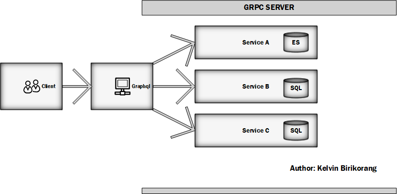

# NestJS + GraphQL + GRPC + CQRS: Microservices

## Framework
> Nestjs
### Explanation
Nest (NestJS) is a framework for building efficient, scalable Node.js server-side applications. It uses progressive JavaScript, is built with and fully supports TypeScript (yet still enables developers to code in pure JavaScript) and combines elements of OOP (Object Oriented Programming), FP (Functional Programming), and FRP (Functional Reactive Programming).

Under the hood, Nest makes use of robust HTTP Server frameworks like Express (the default) and optionally can be configured to use Fastify as well!

Nest provides a level of abstraction above these common Node.js frameworks (Express/Fastify), but also exposes their APIs directly to the developer. This gives developers the freedom to use the myriad of third-party modules which are available for the underlying platform.

### Gateway
> Graphql

### Explanation
Well, I'ven't use this proxy until this past weeks and I must admit is really cool.
Being able to request the data you actually need by the client will really save bandwith
even though it setup is little complex I plan to cover more on this proxy. REST is still 
great until I tried this proxy and it been promoted as a gold standard for microservice.

## Http Protocol
> HTTP/2.0

### Explanation
GRPC setup is little complex to setup as compared with HTTP/1.1
but the benefit is incredible. It uses Google's Protobuf protocol which is 
universal to all languages in terms of compactibility. Since we might support
python in the cluster, This protocol will check both request object and types
for the language which eliminate WET.

---

## Architecture Overview
 
The GraphQL API acts as a gateway/proxy for the different microservices it exposes. The resolvers of the GraphQL API make calls to the gRPC microservices through client-server communication. The services and the data interchange are defined using [Protocol Buffers](https://developers.google.com/protocol-buffers/). The gRPC microservices handle and fulfill the requests whether they are database or storage operations or any other internal or external calls.

## NB
Since we are using Database per serive, relational will be minimal and only exist within a service so NoSQL such as [Cassandra](http://cassandra.apache.org/) or any SQL such as [Cockroach](https://www.cockroachlabs.com/) can be used. But [postgres](https://www.postgresql.org/) is what I love so... :heart:
Also for Event Store, is because [FDIC Law, Regulations, Related Acts](https://www.fdic.gov/regulations/laws/rules/6500-580.html) to keep track of every transactions etc.
Why not use CRUD, if you ask? Is because acid doesn't retain data while ES once written, it can't be munipulated in any way.
Still on that topic though.
### Diagram

A diagram of the architecture is shown below.

> that's my best from [MS Visio](https://en.m.wikipedia.org/wiki/Microsoft_Visio), man that program is hard :sweat_smile: :sweat_smile:

This architecture implements the following Microservice Design Patterns:

1. [Microservice Architecture](https://microservices.io/patterns/microservices.html)
1. [Externalized Configuration](https://microservices.io/patterns/externalized-configuration.html)
1. [CQRS](https://microservices.io/patterns/data/cqrs.html)
1. [Event Sourcing](https://microservices.io/patterns/data/event-sourcing.html)
1. [API Gateway](https://microservices.io/patterns/apigateway.html)
1. [Database per Service](https://microservices.io/patterns/data/database-per-service.html)

## Layers

### API Layer

[NestJS + GraphQL](https://nestjs.com/) acts as the API Layer for the architecture. It takes care of listening for client requests and calling the appropriate back-end microservice to fulfill them.

### Microservice Layer

[NestJS + gRPC](https://grpc.io/) was chosen as the framework to do the microservices. [Protocol buffers](https://developers.google.com/protocol-buffers/) was used as the data interchange format between the client (GraphQL API) and the server (gRPC microservices). NestJS is still the framework used to create the gRPC Microservices.

### Persistence Layer

PostgreSQL is used as the database and [Typeorm](https://typeorm.io/) is used as the Object-Relational Mapper (ORM).
while [EventStore](https://eventstore.com/) to persist concurrent events.
## Deployment

Deployment is done with containers in mind. A Docker Compose file along with Dockerfiles for the GraphQL API Gateway and each microservice are given to run the whole thing on any machine. For production, it's always recommended to use [Kubernetes](https://kubernetes.io/) for these kinds of microservices architecture to deploy in production. [Istio](https://istio.io/) takes care of service discovery, distributed tracing and other observability requirements.

### Node
> Version 12.x
In order to support Nestjs modules, node >=12+ is required

### Microservices

* [x] Authorization svc
* [x] Users svc
* [ ] Other svc

### Credit
I've been reading this book for a while [Microservice Patterns](https://microservices.io/patterns/microservices.html) by Chris Richardson and most of the points mention are standard.
Below are some of Chris Richardson conferences I've listen to:
1. [Using sagas to maintain data consistency in a microservice architecture](https://www.youtube.com/watch?v=YPbGW3Fnmbc&t=2070s)
1. [Developing microservices with aggregates](https://www.youtube.com/watch?v=7kX3fs0pWwc)
1. [Cubes, Hexagons, Triangles, and More: Understanding Microservices by Chris Richardson](https://www.youtube.com/watch?v=rMDjuXTQVkk)

### Suggestions
Thank you for reading, looking forward to discuss on the next group call.
